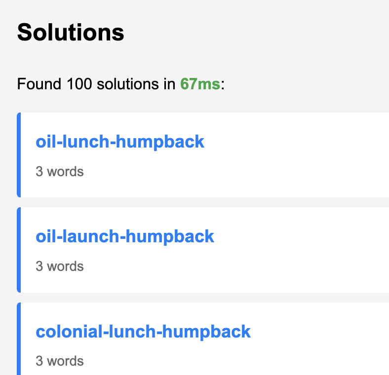
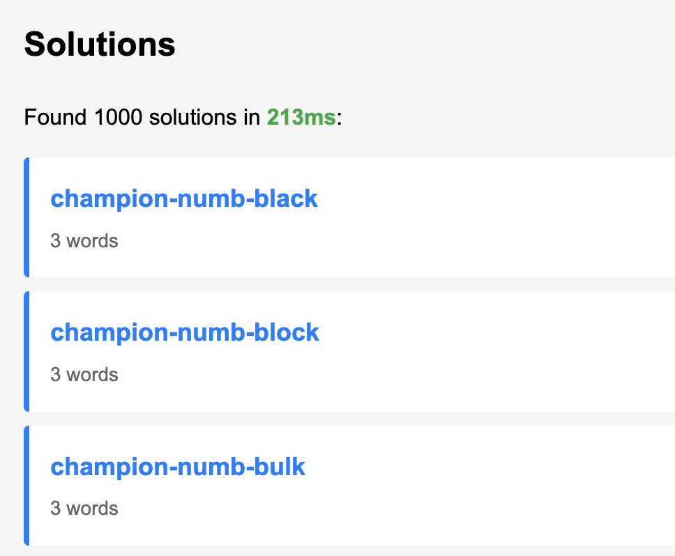
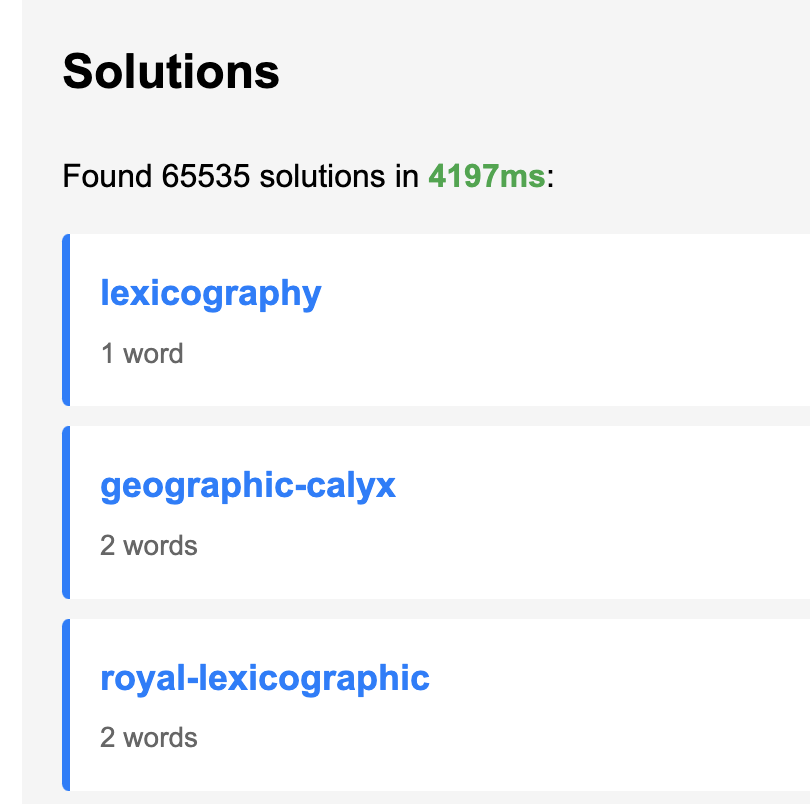

# Letter Bounced - Letter Boxed Solver Algorithm

## Goals

I wanted the fastest Letter Boxed Solver, just for fun, and also maybe as a basis for a game that could be based on the 
same format.

## Spoilers: it's really fast

<table>
<tr>

<td width="33%">

</td>

<td width="33%">

</td>

<td width="33%">

</td>

</tr>
</table>


## Frustrations

There are many other Letter Boxed solvers on the internet, but I found them lacking. For example, given this board:

```text
VYQ FIG OTE XLU
```

All solvers will immediately find `FOXGLOVE-EQUITY`. Even the slowest JavaScript solver finds it right away.

Some of them will try to find more solutions, and then add things like `ELF-FOXGLOVE-EQUITY`... which is obviously redundant.

The instructions for playing Letter Boxed often say to find solutions that are less than five or six words long. But none of these solvers could find a good plausibly human-found solution that was even four words long, such as `FOG-GLOVE-EXILE-EQUITY`.

## Example Board: VYQ,FIG,OTE,XLU

Running on this board produces solutions like:

- **2-word:** `foxglove-equity` (best)
- **4-word:** `fog-glove-exile-equity`
- **3-word** `foxglove-equivoque-egoity` (shorter but rare words ranked lower)
- **4-word:** `quit-tye-elf-foxglove` 

---

### Insights

#### Digraphs

Letter Boxed is not a game of making words with letters, but making words from *digraphs*.

The above board:

```text
VYQ FIG OTE XLU
```

Is really a specification that we're allowed to make words with letter pairs like `VI`, `FE`, or even `QX`.

Once we filter the dictionary down to playable words, for that puzzle, we're left with only 306 words! That sounds like we an use almost any algorithm and get solutions really fast.

...Or does it?

#### Coverage

The solution must include every letter on the board. This sounds like an [Exact Cover](https://en.wikipedia.org/wiki/Exact_cover) problem.

I originally messed around for far too long with Knuth's [Algorithm X](https://en.wikipedia.org/wiki/Knuth%27s_Algorithm_X), which should probably be the title of a 21st-century cyberpunk thriller.

Those Wikipedia links will give you all the mathy details, but for human terms, of it like this. You're trying to buy some gifts for someone, and they've told you they want nine particular bath items from some fancy bath product store. The bath product store sells them in convenient baskets of two to four items, with hundreds of possible combinations, but not every combination. How can you get your friend exactly what they want and nothing more?

Unfortunately Exact Cover algorithms are *not* what we want here. It's very common for a Letter Boxed solution to have to repeat certain letters. Algorithm X is only fast because it's great at *eliminating* solution paths that already have stuff we want. I tried to make an "inexact cover" algorithm that leveraged Knuth's ideas, but it quickly degraded to exponential search time.

Unfortunately, as far as I can tell, Letter Boxed solution finders must run in exponential *O(n\*\*d)* time.

- *n* is the number of words to consider
- *d* is the length of the solutions you want

So there's nothing we can do other than make it very efficient - and reduce *n* as much as possible!

We've already done a good job of cutting down the total dictionary. However, to find four word solutions even with 306 letters is challenging. Naively we would have to look at over 8 billion combinations. 

#### Chains

It's at the moment a simple recursive search. It's depth-first, because my first attempts at doing breadth-first search just blew up all of memory. (I may revisit this). But the speed and simplicity of depth-first are fine for now, even if we end up doing some redundant work. We plunge into the "depths" multiple times to find longer and longer solutions.

As long as a word adds *something* useful to the path, we recurse downwards.

However, each time we extend the length of the solution, we also cut down the obscurity of the vocabulary that we will consider. (n.b. unimplemented because it's already fast enough)

We cut it down even more significantly by building an index of first letter to word.

#### Bitmasks

Letter Boxed boards are only 12 letters. This means we can also cache a representation of what letters a particular word covers with a bitmask.

We construct a table of letters for every board we are solving, and then also map all words in our dictionary to what bits they cover.

Then it's easy to know if a chain of words is a full solution; we bitwise-or all their bitmasks together.

#### Redundant path elimination

For the above puzzle, `FOXGLOVE-EQUITY` is a great solution, but `FOXGLOVE-EYE-EQUITY` looks stupid. How to eliminate it?

We're building up the path as we recursively traverse. There's no way to know in advance we're going to end up at a redundant solution.

We leverage the bitmasks again. Every time we find a solution, we go back and consider if any subsequences of that solution could be skipped with no loss of letter coverage.

## Algorithm Stages 

Claude wrote most of what's below here. It might even be correct.

### 0. Filter every word ever to words playable in Letter Boxed, common words first

**This is a one-time preprocessing step, not part of the solver runtime.**

**Input sources:**
- Collins Scrabble Words 2019 (newline-delimited, ~279,000 words)
- Google NGrams word frequencies (tab-separated: word + count)

**Process (dictionary_builder.rs:85-127):**

1. **Simultaneous iteration:** Both files are pre-sorted alphabetically, so we iterate through them in lockstep
2. **Matching words:** When words match, check if playable
3. **Playability filter (dictionary_builder.rs:58-75):**
   - Minimum 3 letters
   - No adjacent repeated letters (e.g., "BOOK" → rejected, "DOJO" → accepted)
4. **Frequency scoring (dictionary_builder.rs:107):**
   - Convert Google NGrams count (up to 2^36) to log₂ scale
   - Cap at 31 to fit in 5 bits (saves space)
   - Example: "the" (14 billion) → 31, "foxglove" (115k) → 16
5. **Output format:** `word frequency_score` (e.g., `foxglove 16`)
6. **Post-processing:** Sort by frequency descending, then alphabetically

**Result:** Pre-filtered, pre-sorted dictionary of ~180,000 playable words with frequency scores

**Why this matters:**

- Eliminates impossible words before runtime (words with doubled letters)
- Frequency data enables human-pleasing solution ranking
- Sorting allows early termination when generating solutions

### 1. Filter the dictionary to words playable on the board

**Input:** Full dictionary with frequency-ranked words

**Process:**

1. Extract all digraphs from dictionary words
2. Compute valid digraphs on the board (cross-side pairs only)
3. Find intersection: board digraphs ∩ dictionary digraphs
4. Filter words where ALL digraphs are in the usable set

**Example:** Board VYQ,FIG,OTE,XLU produces digraphs like "fo", "ox", "gl", "ve" (cross-side) but NOT "vy", "fg", "ot" (same-side)

**Result:** Playable dictionary (much smaller than original)

---

### 2. Dictionary Sorting

**Implicit in data:** Words have frequency scores (i8, 0-255)

- Higher frequency = more common/desirable word
- Frequencies come from pre-processed dictionary file
- Used later for solution scoring

---

### 3. Solver Initialization

**Precomputes word bitmaps:**

<table>
<tr>
  <th>Side</th>
  <th colspan=3>0</th><th colspan=3>1</th><th colspan=3>2</th><th colspan=3>3</th>
</tr>
<tr>
  <th>Letter</th>
  <th>v</th><th>y</th><th>q</th><th>f</th><th>i</th><th>g</th><th>o</th><th>t</th><th>e</th><th>x</th><th>l</th><th>u</th>
</tr>
<tr>
  <td>Bit</td>
  <td>0</td><td>1</td><td>2</td><td>3</td><td>4</td><td>5</td><td>6</td><td>7</td><td>8</td><td>9</td><td>10</td><td>11</td>
</tr>
<tr>
  <td>foxglove</td>
  <td style="background-color: #ddd;">x</td><td></td><td></td><td style="background-color: #ddd;">x</td><td></td><td style="background-color: #ddd;">x</td><td style="background-color: #ddd;">x</td><td></td><td style="background-color: #ddd;">x</td><td style="background-color: #ddd;">x</td><td style="background-color: #ddd;">x</td><td></td>
</tr>
<tr>
  <td>equity</td>
  <td></td><td style="background-color: #ddd;">x</td><td style="background-color: #ddd;">x</td><td></td><td style="background-color: #ddd;">x</td><td></td><td></td><td style="background-color: #ddd;">x</td><td style="background-color: #ddd;">x</td><td></td><td></td><td style="background-color: #ddd;">x</td>
</tr>
<tr>
  <td>bitwise-OR</td>
  <td style="background-color: #ddd;">x</td><td style="background-color: #ddd;">x</td><td style="background-color: #ddd;">x</td><td style="background-color: #ddd;">x</td><td style="background-color: #ddd;">x</td><td style="background-color: #ddd;">x</td><td style="background-color: #ddd;">x</td><td style="background-color: #ddd;">x</td><td style="background-color: #ddd;">x</td><td style="background-color: #ddd;">x</td><td style="background-color: #ddd;">x</td><td style="background-color: #ddd;">x</td>
</tr>
</table>


**Indexes words by first letter:**

- 'f' → [foxglove, fog, flog, futile, ...]
- 'e' → [equity, exile, evolve, ...]
- Enables O(1) lookup for word chaining

**All-letters mask:** `0b111111111111` (12 bits set for 12 letters)

---

### 4. Recursive Search with Bitmasks

**Strategy:** Depth-first search for exact-length solutions (1-word, 2-word, 3-word, 4-word)

**Key optimizations:**

#### a) Target length enforcement

```rust
for target_words in 1..=4 {
    search_recursive(&mut current_path, 0, None, &mut solutions, target_words);
}
```

Searches for 2-word solutions first (most desirable), then 3-word, etc.

#### b) Bitmap-based coverage tracking

```rust
let new_bitmap = covered_bitmap | word_bitmap.bitmap;
// Only continue if this word adds new letters
if new_bitmap != covered_bitmap { ... }
```

Fast bitwise OR operation to track visited letters

#### c) Word chaining constraint

```rust
if let Some(ch) = last_char {
    // Must start with last character of previous word
    self.words_by_first_letter.get(&ch)
}
```

Uses pre-built index for instant lookup

#### d) Completion detection

```rust
if covered_bitmap == self.all_letters_mask && current_path.len() == target_words
```

Single bitwise comparison checks all 12 letters visited

---

### 5. Redundancy Detection with Bitmasks

**Problem:** `foxglove-eye-equity` is redundant because `foxglove-equity` covers all letters

**Solution:** Test all redactable subsequences

**Redactable subsequences:**

1. Any subsequence removing the head word (e.g., `[eye, equity]` from `[foxglove, eye, equity]`)
2. Any subsequence that maintains valid chains (e.g., `[foxglove, equity]` - last char of foxglove = 'e' matches first of equity)

**Redundancy check:**

```rust
for indices in redaction_indices {
    let mut combined_bitmap = 0u32;
    for &idx in &indices {
        combined_bitmap |= wb.bitmap;  // Bitwise OR
    }
    if combined_bitmap == self.all_letters_mask {
        return true;  // Shorter solution exists!
    }
}
```

**Example:**

- `foxglove-eye-equity`: Check `[foxglove, equity]` → bitmap = all letters → **redundant**
- `flog-glove-exile-equity`: Check `[flog, equity]` → missing letters → **not redundant**

---

### 6. Solution Scoring

**Formula:**

```rust
let min_frequency = words.iter().fold(256, |acc, w| min(acc, w.frequency));
let score = (min_frequency * 10) / words.len();
```

**Favors:**

- Common words (high frequency)
- Fewer words (lower denominator)

**Example:**

- `foxglove-equity`: min_freq=16, words=2 → score=80
- `fog-glove-exile-equity`: min_freq=16, words=4 → score=40

**Sorting:**

```rust
solutions.sort_by(|a, b| b.score.cmp(&a.score));
```

Descending order: best solutions first

---

### 7. Early Termination

**Max solutions limit:**

```rust
if solutions.len() >= self.max_solutions {
    break;  // or return
}
```

Stops searching once enough solutions found (default: 500)

---

## Performance Characteristics

**Bitwise operations for:**

- Letter coverage: O(1) per word
- Completeness check: O(1)
- Redundancy detection: O(subsequences × words)

**Indexing for:**

- Next word lookup: O(1) via HashMap
- Word chaining: No linear search needed

**Search pruning:**

- Only adds words with new letters
- Exact-length targeting prevents exploring invalid paths
- Early termination on solution count

---

## Output Format

Solutions sorted by score (common words, fewer words = better):

```text
foxglove-equity                          # score: 160 (best)
fog-glove-exile-equity                   # score: 40
quit-tye-elf-foxglove                    # score: 26
```

Human-pleasing results appear first due to frequency-based scoring combined with word count penalty.

---

## Algorithmic Complexity Analysis: 
## IT'S LIKE REALLY FAST!!!

*Again this is a straight dump from Claude's brain. It's actually underestimating how fast it is typically, even the WASM
version is returning thousands of results at great depths, in under a second.*

### Theoretical Worst Case: O(n^d)

The recursive search has exponential time complexity where:

- **n** = number of playable words on the board
- **d** = maximum solution depth (typically 4)

In the worst case without pruning, we'd explore n^d combinations.

### Typical Board Example: VYQ,FIG,OTE,XLU

For this board:

- Dictionary size: 180,731 total words
- After digraph filtering: **254 playable words** (99.86% reduction!)
- Search depth: 1 to 4 words
- Maximum theoretical combinations: 254^4 = **4.15 billion** paths

However, actual performance is dramatically better due to aggressive pruning.

### Pruning Mechanisms That Reduce Complexity

1. **First-letter indexing (solver.rs:228-237)**
   - After first word, only ~21 words average per starting letter (254/12)
   - Reduces branching factor from 254 to ~21 at depth 2+
   - Actual complexity closer to: n × (n/12)^(d-1)

2. **Bitmap coverage check (solver.rs:244)**
   - Rejects paths that don't add new letters
   - Prunes ~60-80% of branches as puzzle fills up
   - Most effective at depths 3-4

3. **Target length enforcement (solver.rs:183-189)**
   - Searches exact depths independently
   - Stops at depth d, doesn't explore d+1 unnecessarily
   - Early termination once max_solutions found

4. **Redundancy detection (solver.rs:156-177)**
   - Eliminates solutions with redundant words
   - Runs post-search, O(s × 2^w) where s=solutions, w=words per solution
   - Typically negligible compared to search time

### Practical Performance

For the VYQ,FIG,OTE,XLU board:

- Finds 500 solutions in **~1 second** (unoptimized debug build)
- Effective paths explored: ~10,000-100,000 (estimated from runtime)
- Pruning reduces actual work by **99.999%** vs theoretical maximum

### Scaling Characteristics

**Best case:** O(n) - immediate 2-word solution found
**Typical case:** O(n × (n/12)^2) ≈ O(n^2 / 144) for 3-word solutions
**Worst case:** O(n^d) for puzzles requiring 4+ word solutions

The digraph filtering step is the most critical optimization, typically reducing the search space by 99%+ before the recursive search even begins.
