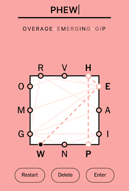
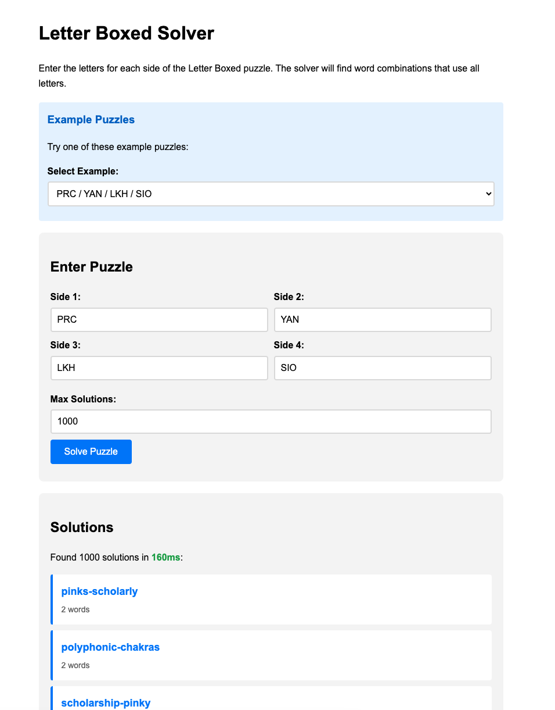

# Letter Bounced 

A solver for the New York Times word puzzle, "Letter Boxed". 

Try it out at https://neilk.github.io/boxchar/ !

## Why?

The New York Times puzzle page is very popular! Yet, the existing solvers that I know of suck.

* Hard to use
* Slow
* Only suggest "best" answers with ridiculously rare words
* Give redundant answers
* Grind to a halt when the solution is more than two words
* Weren't written in Rust

I got obsessed with this game about a year ago and I kept thinking of ways to write a fast solver. Here's my attempt,
and not uncoincidentally it's my first real Rust project.

## Notes on the algorithm

See [algorithm notes](ALGORITHM.md).

## What is Letter Boxed?

Letter Boxed puzzles are a set of letters in a box shape. Players must connect all the letters in the puzzle 
with a chain of valid words, as in the following screenshot.



## Game Rules

1. **Four-sided puzzle**: Letters are arranged on four sides of a square. (Though, boxchar may allow other shapes)
2. **No same-side connections**: You cannot connect two letters from the same side. Think of it as bouncing between sides.
3. **Word chaining**: Each new word must start with the last letter of the previous word
4. **Complete coverage**: All letters must be used across your word sequence

There is no score in the New York Times' version of Letter Boxed, but some puzzles are harder than 
others. Sometimes there are hundreds of solutions, and sometimes there is only one. Skilled players try 
to complete the puzzle in fewer words.

### Example

Given the puzzle:
```
JGH NVY EID ORP
```

A possible two-word solution is: `HYPERDRIVE-ENJOINING`

A possible three-word solution is: `DOVE-ENJOYING-GRYPHON`


Note how each letter hops to a different side, and the words are connected by their first/last letters.

## Installation

Make sure you have Rust installed, then:

```bash
git clone <repository-url>
cd boxchar
cargo build --release
```

## Usage

### Command-line

```bash
$ cat data/game.txt 
YFA
OTK
LGW
RNI

$ time ./target/release/boxchar --board=data/board.txt --max-solutions=10    
forklift-twangy
know-wolf-fragility
know-waif-fragility
now-wakf-fragility
work-kif-flagrantly
work-kif-fragrantly
work-kalif-flagrantly
work-kalif-fragrantly
work-kaif-flagrantly
work-kaif-fragrantly

./target/release/boxchar --board=data/board.txt --max-solutions=10  0.78s user 0.05s system 70% cpu 1.183 total
```

## Web Application

The web application is built with Svelte and powered by Rust/WASM.

### Building the WASM Package

First, build the WASM package from the Rust code (run from repository root):

```bash
./build-web.sh
```

This creates the WASM files in `web/svelte-app/src/pkg/` and copies the dictionary to `web/svelte-app/public/`.

### Development Mode

Run the Svelte development server with hot module replacement.

**From repository root:**
```bash
cd web/svelte-app
npm install  # First time only
npm run dev
```

**Or from `web/svelte-app/` directory:**
```bash
npm install  # First time only
npm run dev
```

Opens at http://localhost:8000/
- Changes update instantly in the browser
- Source maps for debugging
- Optimized for development speed

### Production Build

Build optimized static files for deployment.

**From repository root:**
```bash
cd web/svelte-app
npm run build
```

**Or from `web/svelte-app/` directory:**
```bash
npm run build
```

- Outputs to `web/svelte-app/dist/` directory
- Total bundle: ~50 KB (gzipped) + 2.2 MB dictionary + 79 KB WASM
- Can be deployed to any static hosting (GitHub Pages, Netlify, Vercel, etc.)

### Preview Production Build

Test the production build locally (must be run after `npm run build`).

**From repository root:**
```bash
cd web/svelte-app
npm run preview
```

**Or from `web/svelte-app/` directory:**
```bash
npm run preview
```

Opens at http://localhost:4173/




### Basic Command Structure

```bash
cargo run -- [OPTIONS] [GAME_SPEC]
```

### Specifying the Game

You can specify the game in two ways:

#### 1. Positional Argument (Comma-separated)
```bash
# Specify game directly as comma-separated sides
cargo run -- "YFA,OTK,LGW,RNI"
```

Requirements:
- Only letters (A-Z, a-z) and commas allowed
- No spaces permitted
- Letters are automatically converted to uppercase
- Must have exactly 4 sides with equal lengths

#### 2. File Path (--game option)
```bash
# Load game from a file
cargo run -- --game data/board.txt
```

The game file should contain 4 lines, each representing one side:
```
YFA
OTK
LGW
RNI
```

### Command Line Options

| Option | Description | Default | Required |
|--------|-------------|---------|----------|
| `BOARD_SPEC` | Board as comma-separated sides (e.g., "ABC,DEF,GHI,JKL") | - | Either this or `--board` |
| `--board <PATH>` | Path to board file | - | Either this or `BOARD_SPEC` |
| `--wordlist <PATH>` | Path to wordlist file | `data/wordlist.txt` | No |
| `--help` | Show help information | - | No |

### Examples

```bash
# Using positional board specification
cargo run -- yfa,otk,lgw,rni

# Using board file with custom dictionary
cargo run -- --board data/board.txt --wordlist path/to/custom_dictionary.txt

# Get help
cargo run -- --help
```

### Error Cases

The application will exit with an error if

- There is no clear board specification, from file or command line
- Board specification contains invalid characters (anything other than A-Z, a-z, comma)
- Board file cannot be read or has invalid format
- Dictionary file cannot be read

## Development Commands

```bash
# Build the project
cargo build

# Run with development profile
cargo run

# Run tests
cargo test

# Run specific test
cargo test <test_name>

# Quick syntax check
cargo check

# Run linting
cargo clippy

# Format code
cargo fmt
```

## Game File Format

Game files must follow these rules:

- All sides must have the same length
- No duplicate letters across all sides

Example valid game file:
```
ABC
DEF
GHI
JKL
```

## Dictionary Format

Dictionary files are plain text, should contain one word per line, with two whitespace-separated tokens per line:

- a word in lowercase,
- a frequency score

The file should be sorted with most frequent words first.

The script ./build-dictionary.sh will construct this for you, given the included Collins Scrabble Words, and a sorted list 
of the frequency of all words in Google NGrams. This file is not provided in this repository.


## License

Copyright Neil Kandalgaonkar, 2025. 

This software is *NOT* freely redistributable.

Screenshot by The New York Times - The New York Times Games mobile app, sourced from [Wikipedia's File:NY Times Letter Boxed.png](https://en.wikipedia.org/w/index.php?curid=76415365).
